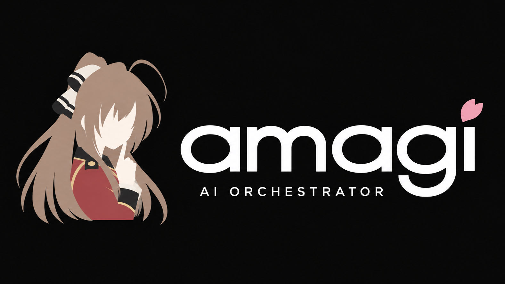

<p align="center">
  
</p>

# amagi

Orchestrates AI coding agents over an issue tracker. Amagi claims ready issues, works each one in its own git worktree, runs project checks, and loops back with fixes until the work passes, then hands it off as a pull request.

## How it works

- **Tracker** (`beads`): issues come from the [beads](https://github.com/gastownhall/beads) issue tracker. Amagi claims the next ready task and keeps the lease alive for the whole run.
- **Harness** (`claude`): the agent that implements and reviews. Runs in a dedicated worktree, so a repo stays clean while work is in flight.
- **Loop**: implement -> project checks -> review -> fix, up to configured round limits.
- **Server**: an HTTP + SSE event feed on `localhost:7777` so tools and humans can watch and steer runs.

## Install

Requires [bun](https://bun.sh). Other tools (`git`, `beads`, `claude`) are resolved at runtime.

```bash
bun install
just check   # lint + typecheck + tests
```

## Usage

```bash
bun run packages/cli/src/index.ts <command>
```

| Command | Description |
| --- | --- |
| `run` | Claim the next ready task and work it in its own worktree |
| `status` | Show the run queue and any open questions |
| `ask` | Ask the human a question and block for the answer |
| `clean` | Remove worktrees and branches for terminal tasks (dry run by default) |
| `config` | Print the resolved configuration and where it came from |

## Configuration

Amagi is configured per-repo (`.amagi/config.toml`) and globally (`~/.config/amagi/config.toml`), later sources win. Trackers, harnesses, loop limits, checks, notifications, and the server address are all configurable; `amagi config` shows the resolved result and its provenance.

## Packages

| Package | Purpose |
| --- | --- |
| `@amagi/core` | Runner, drivers, store, and event feed |
| `@amagi/cli` | The `amagi` command line |
| `@amagi/server` | HTTP + SSE event server |
